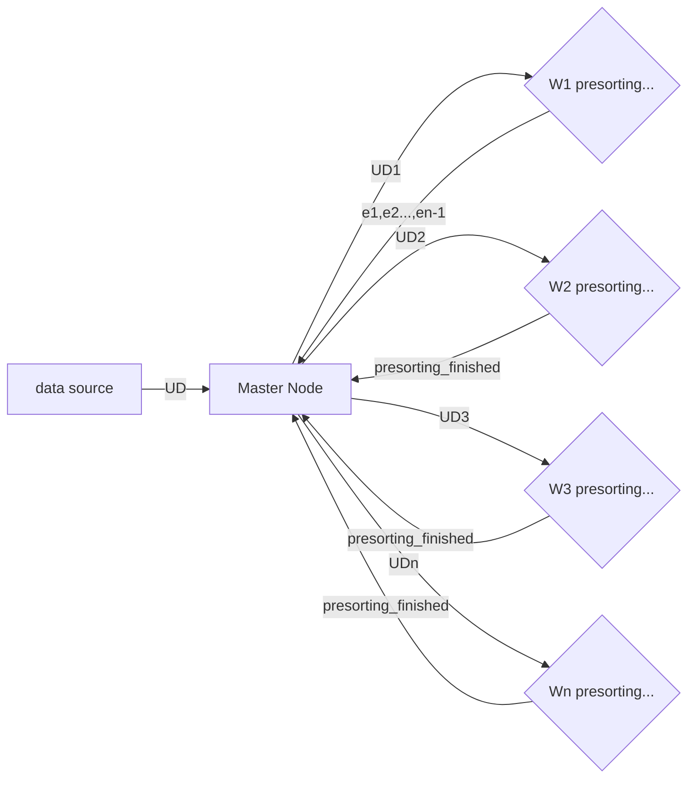
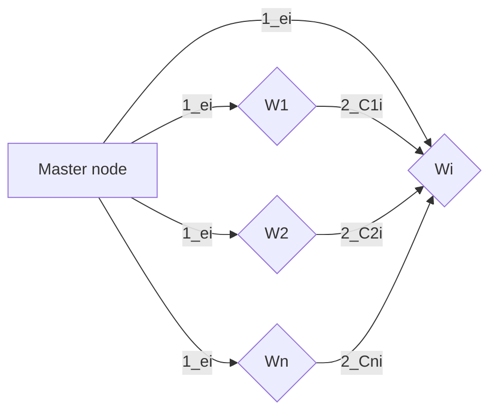

Our design is composed of a master and n workers.
The master is not involved in the sorting, its role is managing communication with the workers
Each worker is named Wi where i is between 1 and n
Name the initial unsorted data (raw) UD, and the final sorted data SD
Name the threshold of data given to each Wi T (50 GB in the slides)
According to the slides, |UD|= 10 TO, so n == 10TO/50GB == 200
In our design, we are assuming that (n-1)*T < |UD| <= n*T for generality

## Step 1: Distribution
Master getting the data and randomly distributing it to the workers.
Assuming that the data arrives in small batches from an external source to the master, the master chooses randomly one of the workers to give it the data.
We will set a counter for each worker of how much data it has been sent to it so that we can assure that no worker got more than T
Otherwise, if the data is internal, we shuffle it and send the exact amount of data to each worker (please tell us in the feedback which case it is)
We will assume in the next steps that all the workers got the same amount of data (statistically it should be nearly the same)
Name UDi unsorted data batch given to each worker Wi

## Step 2: Workers presorting
Each worker Wi sorts its own data
Name this presorted data SDi
Worker 1 divides its data to n equal chunks (named respectively C1j, j from 1 to n)
Name ej the last element of the jth batch of first worker C1j (for every j from 1 to n).
We assume e0 being the smallest element possible (e.g: AAAAAA) and change en to being the biggest element possible (e.g: ZZZZZZ) just for the clarity of the next formula
We name the jth chunk of the Wi Cij where Cji contains all the elements of the set Sj = {e, e £ SDj & e(i-1) <= ei}
Note: W1's ej boundary elements reflect the dataset's distribution accurately enough since the data is very big and randomly distributed to the workers
ChatGPT's suggestion: To avoid bias, consider sampling from all workers rather than only Worker 1. This could mean taking a small, equally distributed sample from each worker to create a global set of boundaries ej making your partitioning scheme more resilient to data skew.

## Step 3: Redistribution
Assuming the workers can handle twice the storage of the threshold (50GB), the following step would be possible.
For i = 1 to n:
    The master requests from each worker its ith chunk (Cji for worker j)
    The master receives all the chunks
    The master sends all these chunks separately to Wi
    Note: This step would be almost linearly more efficient if the workers can communicate. This way, we establish a p2p connection.
ChatGPT's suggestion: Since this step involves many data exchanges, incorporate error handling for chunk transfers (e.g., retries on failure). To prevent re-sending data in the event of network issues, workers can write data to temporary storage, which can then be retrieved by the destination worker upon request.

## Step 4: Merging
Each Wi has n batches Cji that contains elements of the range from e(i-1) to e(i)
Each Wi merges these batches in a sorted way (the merge part of the merge sort algorithm)
Name SDi the new sorted data of each Wi
So for all i1 < i2, for all x1 and x2 elements of SDi1 and SDi2 respectively, x1 < ei1 <=e(i2-1) <= x2
As a result SD1.concat(SD2.concat(....concat(SDn)...)) == SD
ChatGPT's suggestion: Make use of parallelism inside every worker during merging

## Step 5: Sending back
For i= 1 to n:
    Wi sends SDi to master
    Mater stores SDi in the needed destination
    If Wi can store them to the destination directly, it would be helpful
